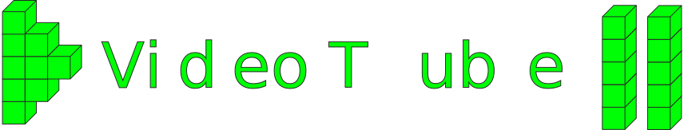

# 📑 Database e Web Programming - hw1
 ## 🌘 Introduzione
 Repository del primo homework di Database e Web programming 2020/2021 modulo Web programming
 ## ✏️ Concept
 Vorrei realizzare una piattaforma simile agli ormai popolarissimi YouTube e Twitch che permetta agli utenti di usufruire dei contenuti creati dai loro artisti preferiti.
 Gli utenti premium possono abbonarsi o meno a un Creator così da supportarlo. Concettualmente parte dei fondi va a [treedom](https://www.treedom.net) 🌳.

 ## ⭐ Nuove Funzioni
 - Implementato il sistema di login e signin;
 - Abilitazione account creator e spectator;
 - Sistema di gestione preferiti;
 - Aggiunta pagina per pubblicazione video;
 - Aggiunta pagina per il video;
 - Aggiunta pagina selezione abbonamenti;
 - Aggiunti video recenti e in tendenza;
 - Aggiunta interazione con il database di VideoTube.
 - Dwayne Johnson 💪

 ## 👷‍♀️ Istruzioni per l'esecuzione
 - Scarica o clona il progetto nella cartella htdocs di xampp;
 - Avvia il server apache e mysql;
 - Accedi al database mysql;
 - Digita i comandi nel file vt.sql o eseguilo con un interprete;
 - Modifica il file db_credentials.php inserendo il tuo username e la tua password per mysql;
 - Collegati alla pagina localhost/path/to/file/hw1.php;

## 🖼️ Screenshots
.png)
.png)
.png)
.png)
.png)
.png)
.png)
.png)
.png)
.png)
.png)
.png)
.png)
.png)
.png)
.png)

 ### 👤 Credits:
 Rosario Caggegi o46002042     
 
 
 
